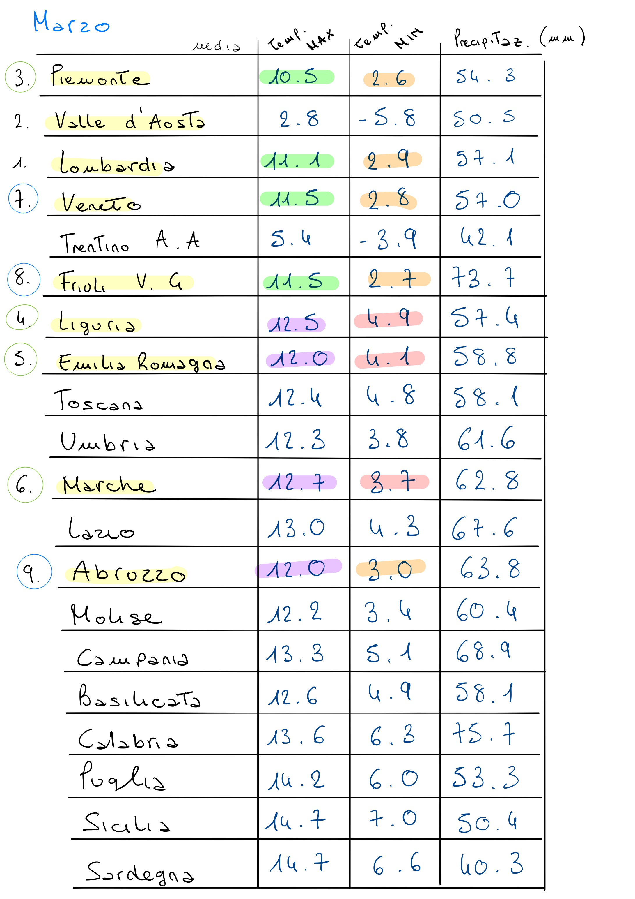
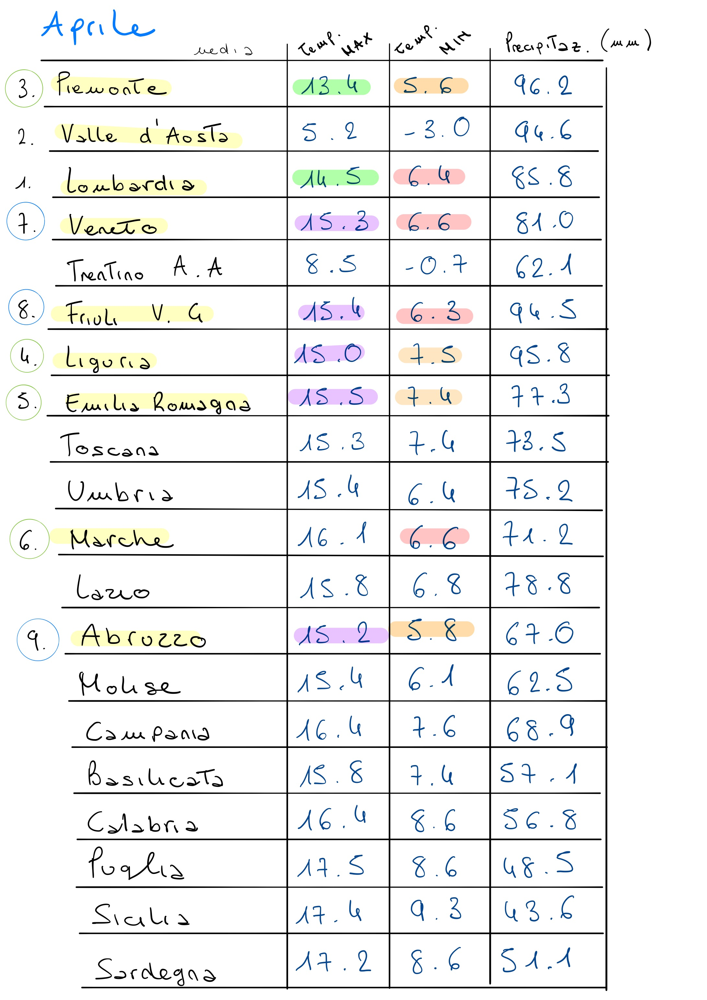
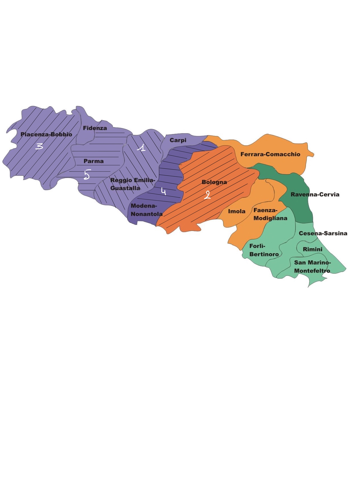
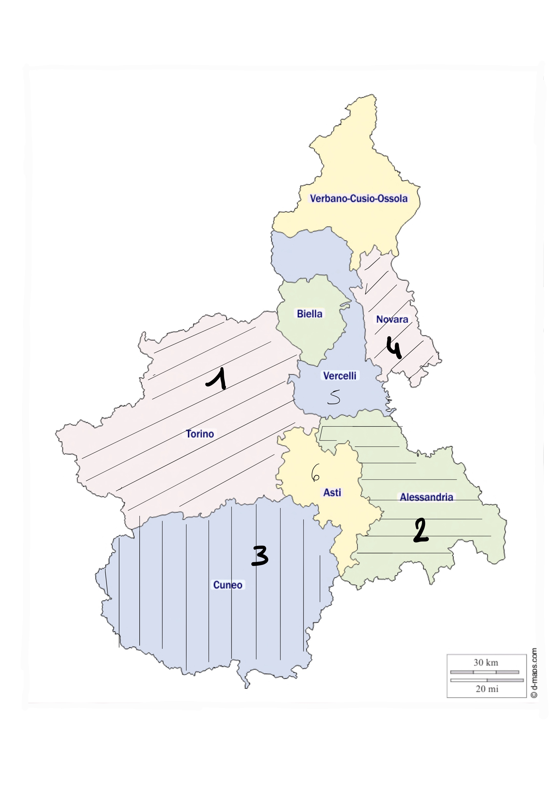
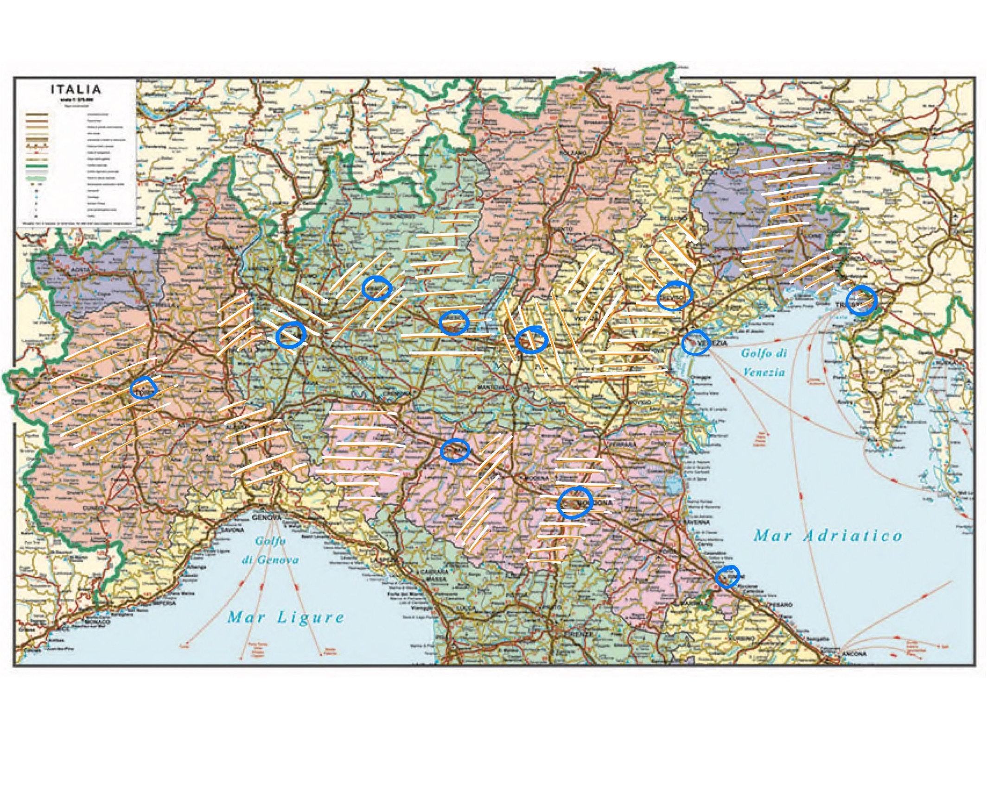

```{r setup, include=FALSE}
knitr::opts_chunk$set(cache = TRUE, warning = FALSE, message = FALSE, echo = FALSE )
getwd()
## TODO FOR RUN IN YOUR PC 
##setwd()
```


```{r library }
## data analisys
library(dplyr)
library(tidyverse)
library(lubridate) 

## plotting
library(ggplot2)
library(ggExtra)
library(gganimate)
library(plotly)
library(reshape2)
library(gifski)
```

## Introduzione

Trattandosi di una pandemia ancora in evoluzione, in cui entrano in gioco svariati fatto, molti dei quali difficili da comprendere, non avendo una conoscenza del dominio adatta, si proverà a confermare delle ipotesi deducibili attraverso la logica con l'ausilio dei dati a disposizione.

Si assume che i dati presi in considerazione siano affidabili e descrivano il fenomeno in modo corretto, lasciando da parte teorie complottistiche di vario tipo. 

Sono stati utilizzati i seguenti dataset:

- https://github.com/CSSEGISandData/COVID-19 per i dati globale.

- https://github.com/pcm-dpc/COVID-19 per i dati italiani. 

- https://datahub.io/JohnSnowLabs/country-and-continent-codes-list per raggruppare gli stati mondiali nei corrispettivi continenti. 

L'utilizzo di repository di *GitHub* hanno permesso di mantenere aggiornati i dataset con facilità. 

### Obiettivi
Il report si pone di risolvere i seguenti interrogativi: 

- eseguire un analisi sui dati mondiali cercando di capire gli andamenti dell'epidemia; 

- eseguire un analisi sui dati mondiali raggruppati per continente, classificandoli per gravità di diffusione del virus, capendo le differenze fra di essi;

- eseguire un analisi sui dati italiani, partendo dai dati nazionali fino ai dati delle provincie per comprendere l'andamento del fenomeno;

- in riferitmento all'Italia, cercare una possibile correlazione tra tamponi e conteggio dei positivi; 

- analizzare i dati regionali con lo scopo di capire quali sono state le regioni più colpite, riguardo contagi e terapie intensive, individuando un qualche dato in comune;

- analizzare i dati provinciali all'interno delle regioni maggiormente colpite per verificare se c'è stato un andamento comune o ipotizzare il motivo nel caso contrario.

Per rispondere a tali quesiti si sono adoperati dati di carattere globale, contenenti le informazioni per ogni stato, e i dati riguardanti l'Italia, divisi sia per regione sia per provincia.
Nell'analisi sono stati considerati i dati fino al giorno 29/06/2020. 

<!-- SITUAZIONE MONDIALE -->

# Analisi della situazione mondiale
## Preprocessing del dataset globale

```{r}

## load dataset 
global_df_init <- read.csv("Data/GitRepoData/csse_covid_19_data/csse_covid_19_time_series/time_series_covid19_confirmed_global.csv" )

head(global_df_init )
```

<!-- primo obiettivo :  visualizzare l'andamento della curva di contagio di tutto il mondo. -->

Per prima cosa è necessario pulire e trasformare il *dataset* attandolo al nostro scopo. 
Si eseguono le sequenti manipolazioni: 

- dividere i dati per data e non per stato;
- rimuovere colonne inutili per l'analisi;
- per ogni data avere una singola riga per stato; 
- creare un dataframe con contagi, guariti, morti.


```{r}
## preprocessing 
global_df_date = global_df_init %>% 
  gather(X1.22.20:X6.29.20, key ="date", value = "cases") %>%  ## remember to update final date
  select( -Lat, -Long ) 


global_df_date$date = substring( global_df_date$date, 2)
names(global_df_date)[names(global_df_date)=="Country.Region"] <- "country"

global_df_date = global_df_date %>% 
  mutate( date = mdy(date) ) %>% 
  group_by( country, date ) %>%  ## avendo country duplicati
  summarise( 
    cases = sum( cases )
    ) %>%
  ungroup() # per utilizzare plotly
  

## calcolo valori per data  
global_data = global_df_date %>% 
    group_by(  date ) %>% 
    summarise(
      cases = sum( cases )
    ) 

# per il plot non consideriamo paesi con meno di 10_000 casi 
global_filter = global_df_date %>%
  filter( cases > 20000 )

global_filter_noUs_Brazil <- global_filter %>% 
        filter( country != "US" & country != "Brazil")

```

## Visualizzazione dei dati globali 

<!-- data plot --> 
Viene data una prima visualizzazione della curva dei contagi totale per ogni paese con un numero di casi ritenuto rilevante. 
È stata utilizzata una scala logaritmica per apprezzare meglio l'andamento totale sul numero di positivi. 

Utilizzando *ggplotly* si ha la possibilita di avere un grafico interattivo, per analizzare meglio la curva e la differneza tra stati. 


```{r  fig.align='center'}

## plot global data 

p <- ggplot( global_df_date, aes( x = date, y = cases, group = country,)) + 
  geom_line( alpha = 0.3 ) + 
  scale_y_log10() + 
  theme_minimal()  

ggplotly(p)

```

```{r  fig.align='center'}

p <- ggplot( global_filter, aes( x = date, y = cases, group = country,)) + 
  geom_line( alpha = 0.3 ) + 
  scale_y_log10() +
  theme_minimal()  

ggplotly(p)

p <- ggplot( global_filter, aes( x = date, y = cases, group = country,)) + 
  geom_line( alpha = 0.3 ) + 
  theme_minimal()  

ggplotly(p)

```

Concentradosi sui casi più significativi, si può notare come la Cina, pur avendo riscontrato i primi casi, è riuscita ad abbassare la curva con buoni risultati. 

Risulta infatti che abbia un numero di contagi inferiore alla maggior parte degli stati Europei, inoltre il numero di contagi totale si è stabilizzato in maniera molto rapida rispetto ad altri stati che hanno impiegato quasi più di un mese per abbassare i contagi giornalieri. 


```{r  fig.align='center'}

## plot per singolo stato completo 
ggplot( global_filter, aes( x = date, y = cases ) ) + 
  geom_line( aes( group = country, color = country) , alpha = 1.2 ) + 
  facet_wrap( ~country ) +
  theme_minimal() + 
  theme(legend.position="none",
        axis.text.x = element_text(angle = 70, hjust = 1 ),
        axis.text.y = element_blank()) 

```

 --- 
 
<!-- Per visualizzare meglio le curve degli altri stati, si tolgono i dati di America e Brazile -->

Stabilito che US e Brazile hanno un numero di contagi molto superiore rispetto agli altri, andiamo a rimuoverli dal dataset, per visualizzare singolarmente i restanti stati. 

```{r  fig.align='center'}

# ggplot( global_maj_noUS, aes( x = date, y = cases ) ) + 
#   geom_line( aes( group = country, color = country) , alpha = 1.2 ) + 
#   facet_wrap( ~country ) +
#   theme_minimal() + 
#   theme(legend.position="none",
#         axis.text.x = element_text(angle = 70, hjust = 1 ),
#         axis.text.y = element_blank()) 


## plot per singolo stato, senza Brasile a US 
ggplot( global_filter_noUs_Brazil, aes( x = date, y = cases) ) + 
  geom_line( aes(group = country, color = country ), alpha = 1.2 ) + 
  facet_wrap( ~country ) +
  theme_minimal() + 
  theme(legend.position="none",
        axis.text.x = element_text(angle = 70, hjust = 1 ),
        axis.text.y = element_blank()) 

```

Si può notare come l'inizio dei contagi è avvenuto in mesi diversi nei singoli stati ed esso non è comune tra gli stati dello stesso continente.

Questo fatto può essere imputato ai diversi flussi di commercio e turismo con stati esteri in uno stesso continente. 

Un ulteriore differenza può essere il momento in cui sono iniziati i rilevamenti dei casi sulla popolazione, come diverse sono state le politiche utilizzate per contenere la pandemia. 


```{r include=FALSE}
## delete data from env. 
remove( global_filter )
remove( global_filter_noUs_Brazil)
```

## Plot dati cumulativi  

```{r }
## load data 
global_rec_init <- read.csv("Data/GitRepoData/csse_covid_19_data/csse_covid_19_time_series/time_series_covid19_recovered_global.csv" )
head( global_rec_init, 2 )

global_death_init <- read.csv("Data/GitRepoData/csse_covid_19_data/csse_covid_19_time_series/time_series_covid19_deaths_global.csv")
head( global_death_init, 2 )

```

```{r}

## recovery processing
global_rec_forDate = global_rec_init %>% 
  gather(X1.22.20:X6.29.20, key ="date", value = "cases") %>% 
  select( -Province.State, -Lat, -Long )
remove( global_rec_init )

global_rec_forDate$date = substring( global_rec_forDate$date, 2)
names(global_rec_forDate)[names(global_rec_forDate)=="Country.Region"] <- "country"


global_rec = global_rec_forDate %>% 
  group_by(  date ) %>% 
  summarise( 
    tot_rec = sum( cases )
    ) %>%
   mutate( date = mdy( date ))

remove( global_rec_forDate )

## deaths processing
global_death_forDate = global_death_init %>% 
  gather(X1.22.20:X6.29.20, key ="date", value = "cases") %>% 
  select( -Province.State, -Lat, -Long )
remove( global_death_init )

global_death_forDate$date = substring( global_death_forDate$date, 2)
names(global_death_forDate)[names(global_death_forDate)=="Country.Region"] <- "country"

global_death = global_death_forDate %>% 
  group_by( date ) %>% 
  summarise( 
    tot_deaths= sum( cases )
    ) %>%
   mutate( date = mdy( date ))

remove( global_death_forDate)
```


Si nota come la curva dei contagi ha tendenza esponeziale, caratteristica comune a diverse pandemie.  
Per completezza si aggiungono le curve dei guariti e dei morti. 


```{r fig.align='center'}

### join tra i dataset di contagi, guariti e morti 
global_ <- full_join( global_data, global_rec, )
global <- full_join( global_, global_death)

## rimuoviamo data inutili
remove( global_ )
remove( global_data )
remove( global_rec )
remove( global_death )

names(global)[names(global)=="cases"] <- "infects"
names(global)[names(global)=="tot_deaths"] <- "deaths"
names(global)[names(global)=="tot_rec"] <- "recovered"

### per ogni data ho tre valori, ognuno relativo a un tipo di dato 
global <- gather(global, key = "type", value = "n_cases",
       infects, recovered, deaths)

ggplot( global, aes( x = date, y = n_cases, group = type, color = type ) ) + 
  geom_line( ) + 
  geom_point( size = 0.1) + 
  theme_minimal() + 
  ylab( "total cases" )

```


La curva delle guarigioni ha un incremento simile a quella degli infetti, ma più graduale, al contrario i decessi crescono sempre più lentamente.

Le motivazioni di questi andamenti potrebbero essere: 

- capacità ospedaliere per quanto riguarda le terapie di guarigione sono aumentate con la conoscenza del virus (e quindi con il tempo);
 
- il virus con il passare del tempo è diventato meno aggressivo (ma non lo si può affermare con certezza);

- l'improvviso espandersi dell'epidemia ha messo in crisi i reparti ospedalieri (con un numero iniziale di persone molto alto, che è andato diminuendo) e riuscendo a colpire le fasce più deboli della popolazione che successivamente sono state più attente riguardo la sicurezza personale. 
 
 

# Analisi tra continenti

È stato utilizzato un *dataset* contente il corrispettivo continente per ogni stato, in modo da suddividerli facilmente.
Per semplicità nella suddivisione, i paesi transcontinentali sono stati raggruppati rispetto uno solo dei continenti di appartenenza. 
Prima di raggruppare gli stati per continente occorre: 

- verificare l'assenza di stati;

- verificare la coerenza dei nomi tra i due dataset;

- eseguire un join fra i dataset con gli attributi d'interesse; 


```{r}

## load data for join country and continent 
continent_list_df <- read.csv("Data/OtherData/continent/continent_list.csv")

## per rimuovere seconda parte del nome dello stato 
continent_list_df <- continent_list_df %>%
  separate(Country_Name, into = c("name", "prefix"), sep = ",") %>%
  mutate(name = stringr::str_replace(name, "United States of America", "US")) %>% ## per uniformare i nomi 
  mutate(name = stringr::str_replace(name, "United Kingdom of Great Britain & Northern Ireland", "United Kingdom"	)) %>%
  mutate(name = stringr::str_replace(name, "Taiwan", "Taiwan*"	)) %>%
  mutate(name = stringr::str_replace(name, "Libyan Arab Jamahiriya", "Libya"	)) %>%
  select( Continent_Name, name )

   
## check numero di stati nel database covid 
global_check <- global_df_date %>% 
  group_by( country ) %>%
  count() ## raggruppo date 
  # nrow()
# 188 
  
## full join per verificare dati mancanti 
check <- full_join( global_check, continent_list_df, by = c("country" = "name") )
## return dataset con solo le righe in cui ci sono dei dati mancanti x
#check[!complete.cases(check),]


#nrow( continent_list_df )

#### PER SEMPLICITA ASSUMIAMO RUSSIA IN EUROPA e TURCHIA PURE ###

continent_list_df <- subset(continent_list_df, name!="Russian Federation" &  name!="Turkey")

continent_list_df[nrow(continent_list_df) + 1,] = c("Europe", "Russian Federation")
continent_list_df[nrow(continent_list_df) + 1,] = c("Europe", "Turkey")

## ADD
## Brunei  (ASIA)
## Burma   ( ASIA ) 
## Congo (Brazzaville)
## Congo (Kinshasa)
## Eswatini (AFRICA) 
## Holy See -> Vaticano  (EUROPE)
## Kosovo  (EUROPE)
## Laos  ( ASIA ) 
## West Bank and Gaza ( ASIA ) 
continent_list_df[nrow(continent_list_df) + 1,] = c("Asia", "Brunei")
continent_list_df[nrow(continent_list_df) + 1,] = c("Asia", "Burma")
continent_list_df[nrow(continent_list_df) + 1,] = c("Asia", "Laos")
continent_list_df[nrow(continent_list_df) + 1,] = c("Asia", "West Bank and Gaza")
continent_list_df[nrow(continent_list_df) + 1,] = c("Europe", "Holy See")
continent_list_df[nrow(continent_list_df) + 1,] = c("Europe", "Kosovo")
continent_list_df[nrow(continent_list_df) + 1,] = c("Africa", "Eswatini")
continent_list_df[nrow(continent_list_df) + 1,] = c("Africa", "Congo (Kinshasa)")
continent_list_df[nrow(continent_list_df) + 1,] = c("Africa", "Congo (Brazzaville)")

## MODIFY 
## Czechia -> Czech Republic 
## Kyrgyzstan -> Kyrgyz Republic
## Korea, South ->  Korea 
## Libya -> Libyan Arab Jamahiriya 
## North Macedonia -> Macedonia 
## Russia -> Russian Federation (Europa) 
## Slovakia -> Slovakia (Slovak Republic)
## Syria -> Syrian Arab Republic
global_df_correct <- global_df_date %>% 
  mutate(country = stringr::str_replace(country, "Cabo Verde", "Cape Verde"	)) %>%
  mutate(country = stringr::str_replace(country, "Czechia", "Czech Republic"	)) %>%
  mutate(country = stringr::str_replace(country, "Kyrgyzstan", "Kyrgyz Republic"	)) %>%
  mutate(country = stringr::str_replace(country, "Korea, South", "Korea"	)) %>%
  mutate(country = stringr::str_replace(country, "North Macedonia", "Macedonia"	)) %>%
  mutate(country = stringr::str_replace(country, "Russia", "Russian Federation"	)) %>%
  mutate(country = stringr::str_replace(country, "Slovakia", "Slovakia (Slovak Republic)"	)) %>%
  mutate(country = stringr::str_replace(country, "Syria", "Syrian Arab Republic"	))
  
remove( global_df_date )

global_check <- global_df_correct %>% 
  group_by( country ) %>%
  count() ## raggruppo date 
  # nrow()
# 188 
  

## full join per verificare dati mancanti 
check <- full_join( global_check, continent_list_df, by = c("country" = "name") )
#check[!complete.cases(check),]

remove( check )
remove( global_check )
## ci sono anche due crociere: - MS Zaandam e Diamond Princess 

continent_df <- inner_join( global_df_correct, continent_list_df, by = c( "country" = "name") )
remove( continent_list_df )
```


Casi per continente: 

```{r fig.align='center'}

## group continent cases
t_continent <- continent_df %>% 
  group_by( Continent_Name ) %>% 
  summarise(
    cases = sum( cases ) 
  )

sum <- sum( t_continent[4,"cases"], t_continent[6,"cases"]  )
t_continent = t_continent %>% add_row( Continent_Name = "America", cases = sum )

t_continent %>% 
  arrange( -cases )
```


## Calcolo dell'indice di prevalenza 

Per analizzare al meglio i dati continentali occorre prendere in considerazione altre informazioni. 

Una di queste sono le informazioni riguardanti la popolazione, ci permette di calcolare l'indice di **prevalenza**: 

    esso è il rapporto tra il numero di eventi sanitari rilevati in un certo momento e il numero della popolazione.

Calcolandoli per continente si hanno dei risultati abbastanza generali, tenendo conto che ci sono paesi con molti contagi e altri con quasi nessun caso. 

 ---
 
 Informazioni generali sui continenti: 
 
```{r, fig.align='center'}

## data from wikipedia 

continenti <- c("Asia", "America", "Africa", "Europe", "Oceania")
area <- c( 43810000, 42330000, 30370000, 10400000, 9010000)
popolazione <- c( 4463000000, 1001000000, 1200000000, 741000000, 40000000 )
densita <- c( 100, 22, 36, 73, 5 )

info_continents <- data.frame(Continent_Name=continenti, area=area, popolazione=popolazione, densita=densita)
info_continents

```

Si crea una funzione per il calcolo e visualizzazione della prevalenza, dato un dataset con numero di casi e popolazione 

```{r , fig.align='center'}

compute_prevalence_perc <- function(pop, cases){
  (cases/pop)*100
}

## prevalenza su 1_000_000 di abitanti 
compute_prevalence_abit <- function(pop, cases){
  (cases/pop)*1000000
}

## passiamo alla funzioni i valori su cui fare il calcolo e la variabile per raggruppare i dati nel grafico 
## facendo ciò possiamo riutilizzare la funzione qualsiasi sia il dataset e la label dei dati 

## il dataset deve avere colonna popolazione e cases, inoltre la var di raggruppamento deve esser rinominata come "group" (per poter usar la funzione su dati di differente tipo)

compute_and_visualize_prevalence <- function(dataset, plot=TRUE){
  
  dataset <- dataset %>% 
    mutate( prev_perc = compute_prevalence_perc(popolazione, cases)) %>% 
    mutate( prev_abt = compute_prevalence_abit(popolazione, cases)) %>% 
    arrange( -prev_perc )


  if( plot ){
    ggplot( dataset, aes( x = popolazione, y = prev_perc, color = group ) ) + 
      geom_point( size = 2, shape = 8 ) + 
      geom_text(aes(label=group), hjust=0.5, vjust=1.4) +
      theme_minimal() + 
      theme( legend.title = element_blank() )  + 
      xlab("popolazione") + 
      ylab("prevalenza %")
  }
  
}
```

```{r width = 6, fig.align='center'}

t_continent <- subset(t_continent, Continent_Name!="North America" &  Continent_Name!="South America")
t_continent <- inner_join( t_continent, info_continents )

names(t_continent)[names(t_continent)=="Continent_Name"] <- "group"

compute_and_visualize_prevalence( t_continent )

names(t_continent)[names(t_continent)=="group"] <- "Continent_Name"

```

L'America pur avendo un numero di casi maggiore dell'Europa ha un indice di prevalenza di poco minore, questo perchè la popolazione dell'Europa e pari a quasi $3/4$ di quella americana. 

In Europa ( a parte la Russia ) la situazione, dai grafici dei dati complessi, sembra essersi stabilizzata, nonstante ciò ci sono parecchi stati europei con un numero di contagi totale rilevante. 

L'Asia pur avendo una densità di popolazione molto alta, quindi con più possibilità di contatto tra le persone, ha una percentuale di prevalenza molto inferiore rispetto ad America ed Europa. Si ricorda però che l'Europa ha nei sui dati la Russia, la quale ha un numero di contagi elevato, mentre l'America ha sia il Brasile che gli Stati Uniti con il numero di contagi che cresce giornalmente. 

Casi significativi in Asia hanno un numero di contagi minore (vedi Cina o Iran), e in India i numeri di contagi crescono giornalmente ma non si hanno tante rilevazioni quante, per esempio, in Brasile. 

## Andamento dei contagi per continente 

Questo grafico può riassumere le considerazioni fatte:

- inizio dei contagi differente per ogni continente;

- andamenti simili, ma con rapidità differenti;

- in Europa c'è un abbassamento della curva ( Russia esclusa );
 
```{r  fig.align='center'}
group_continent <- continent_df %>% 
  group_by( date, Continent_Name ) %>% 
  summarise(
    cases = sum( cases ) 
  ) %>%
  ungroup()


p <- ggplot( group_continent, aes( x = date, y = cases, group = Continent_Name, color = Continent_Name)) + 
  geom_line( alpha = 0.3 ) + 
  theme_minimal()  + 
  guides(color=guide_legend("Continenti")) 
  
fig <- ggplotly(p)
fig

```

Per visualizzare meglio il momento in cui i primi contagi sono avvenuti: 

```{r  fig.align='center'}

ggplot( group_continent, aes( x = date, y = cases, group = Continent_Name, color = Continent_Name)) + 
  geom_line( alpha = 2 ) +
  facet_wrap(~Continent_Name)+
  theme_minimal() 

```

Dai grafici precedenti possiamo affermare che, gli unici cpntinenti in cui la curva sembra essersti stabilizzata sono Europa e Oceania. 
In Africa la curva sta iniziando a salire rapidamente, questo può esser imputato al fatto che il virus si è diffuso più tardi rispetto agli altri continenti, ed non avendo una struttura di trasporti, e quindi di contatti tra diverse località, ampia come gli altri continenti, il virus ha trovato difficoltà nel diffondersi. 

Si può notare come Nord America e Europa, paesi in cui la popolazione è ormai abituata a muoversi molto tra località anche lontane, attraverso l'utilizzo di aerei e treni, hanno avuto una crescita iniziale molto rapida. 

Prenderemo successivamente come caso di studio le province italiane, per verificare se l'utilizzo frequente e abituale di mezzi di trasporto veloci può influire alla diffusione più rapida e mirata sui nodi principali del trasposporto passeggeri. 

Si prova a costruire un modello per America e Europa per comparare gli andamenti. 


```{r figures-side, fig.show="hold", out.width="50%",echo=FALSE}
## ragruppo America del nord e del sud 
america_data <- group_continent %>% 
  filter( Continent_Name == "North America" | Continent_Name == "South America") %>%
  group_by( date ) %>% 
  summarise(
    cases = sum(cases)
  )

## compute regression model for America 
america_data$date <- as.numeric(america_data$date)

cor( america_data$date, america_data$cases)

mod1 <- lm( cases ~ date, data = america_data)

#summary(mod1)
mod1$coefficients

ggplot(america_data, aes(date,cases)) + 
  geom_line() + 
  geom_abline(intercept = mod1$coefficients[1], 
              slope = mod1$coefficients[2], 
              color = "blue") + 
  theme_minimal() + 
  theme( axis.title.x =  element_blank(), 
         axis.text.x = element_blank())+ 
  labs( title = "Americhe")

## compute regression model for Europe 
europe_data <- group_continent %>% 
  filter( Continent_Name == "Europe") %>%
  group_by( date ) %>% 
  summarise(
    cases = sum(cases)
  )

europe_data$date <- as.numeric(europe_data$date)

cor( america_data$date, america_data$cases)

mod2 <- lm( cases ~ date, data = europe_data)

#summary(mod2)
mod2$coefficients

ggplot(europe_data, aes(date,cases)) + 
  geom_line() + 
  geom_abline(intercept = mod2$coefficients[1], 
              slope = mod2$coefficients[2], 
              color = "red") + 
  theme_minimal() + 
  theme( axis.title.x =  element_blank(), 
         axis.text.x = element_blank()) + 
  labs( title = "Europe") + 
  ylim ( 0, max(america_data$cases) / 100 * 110 ) ## per metterlo a confronto con l'america 

remove( america_data )
remove( europe_data )

```
 
Pur avendo un indice di prevalenza maggiore rispetto l'America, i contagi in Europa sono cresciuti meno rapidamente e negli ultimi mesi si sono appiattiti, la retta di regressione risulta infatti meno pendente.  

```{r include=FALSE }
## delete data from env. 
remove( global_df_correct )
remove( info_continents )
remove( group_continent )
remove( continent )
remove( continent_df )
remove( continent_list_df )
remove( t_continent )
```

------------------------

# Analisi della situazione in Italia

```{r include=FALSE}
data_ita_init <- read.csv("Data/GitRepoIta/dati-andamento-nazionale/dpc-covid19-ita-andamento-nazionale.csv" )

data_ita_init$data = substring( data_ita_init$data, 1, 10)

data_ita_tidy <- data_ita_init %>% 
  select( -stato, -casi_testati, -note ) %>% 
  mutate( data = ymd(data))

remove( data_ita_init )
```

## Preprocessing e visualizzazione dei dati 

Visualizzazione dei contagi per regione. 

Per positivi si tiene conto di tutte le persone infettate fino a quella data. 

```{r figures-side2, fig.show="hold", out.width="50%" }

ita_date <- data_ita_tidy %>% 
  group_by( data ) %>% 
  summarise(
    totPos = sum( totale_positivi ), 
    newPos = sum( nuovi_positivi ),
    deceduti = sum(deceduti),
    tamponi = sum( tamponi )
  )

## mi devo calcolare i tamponi giornalieri 

ggplot( data = ita_date ) +
  geom_line( mapping = aes( x = data, y = totPos), size = 0.5 ) +
  theme_minimal() + 
  theme( axis.text.x = element_text(angle = 60, hjust = 1 )) + 
  ylab("n° totale di contagi")

ggplot( data = ita_date, aes( x = data, y = newPos) ) +
  geom_line( size = 0.5) + 
  theme_minimal()+ 
  theme( axis.text.x = element_text(angle = 70, hjust = 1 )) + 
  ylab("n° positivi giornaliero")

```

Le misure di precauzione prese dal governo hanno avuto un effetto positivo per quanto riguarda la diminuzione delle persone positive al virus sul territorio nazionale. 
Si può confermare l'andamento esponenziale dei contagi. 

 --- 
 
## Analisi sul numero di tamponi effettuati 

Si mostra l'andamento dei tamponi effettuati nel corso della pandemia per vedere se è presente una relazione con l'andamento dei casi positivi registrati giornalmente. 
I seguenti grafici mostrano l'andamento dei contagi giornalieri in relazione al numero di tamponi effettuati. 
 
```{r figures-side3, fig.show="hold", out.width="50%",  echo=FALSE}

## dobbiamo calcolare il numero di tamponi per giorno ( abbiamo un il dato di tamponi totali fino a una certa data )

## lag per cercare il valore precedente a quello che sto valutando 

ita_date <- ita_date %>% 
  arrange( data ) %>% 
  mutate( diff_tamponi = tamponi - lag(tamponi, default = first(0))) %>% 
  mutate( perc_tamponi_casi = (newPos/diff_tamponi) *100 ) 
  
ita_data_tamponi <- ita_date %>% 
  select( data, newPos, diff_tamponi, perc_tamponi_casi ) %>% 
  gather( key = "type", value = "n", newPos,  perc_tamponi_casi)

ggplot( ita_date , aes( x = data, y = newPos, size = tamponi )) +
  geom_point( alpha = 0.5 ) + 
  ylab( "nuovi positivi") + 
  guides( size = guide_legend("n° tamponi") )

ggplot( ita_date , aes( x = data, y = newPos, size = perc_tamponi_casi )) +
  geom_point( alpha = 0.5 ) + 
  ylab( "nuovi positivi") + 
  guides( size = guide_legend("% casi/tamponi ") )


```

Il numero di tamponi effettuati ogni giorno è aumentato considerevolmente, per riuscire a tracciare maggiormente i nuovi casi e manternere sotto controllo la diffusione. 

All'inizio della pandemia si ha una % casi su tamponi alta rispetto alla fine, con un numero elevato di tamponi in quel perdiodo probabilmente si avrebbe avuto un numero di casi rilevati ancora maggiore, ma non si può affermare con certezza. 

------------------------

# Analisi dei dati regionali 

Si prendono ora in considerazione i dati delle singole regioni.

```{r fig.show = "hold", out.width="70%" , fig.align='center'}

data_regioni_ita_init <- read.csv("Data/GitRepoIta/dati-regioni/dpc-covid19-ita-regioni.csv")

data_regioni_ita_init$data = substring( data_regioni_ita_init$data, 1, 10)
names(data_regioni_ita_init)[names(data_regioni_ita_init)=="denominazione_regione"] <- "regione"

data_regIta_tidy <- data_regioni_ita_init %>% 
  select( -stato, -codice_regione, -lat, -long, -casi_testati, -note ) %>% 
  mutate( data = ymd(data))

## ASSICURIAMOCI CHE CI SIA UN DATO DI REGIONE PER DATA 
data_regIta <- data_regIta_tidy %>% 
  group_by(data, regione ) %>% 
  summarise(
    new_pos = sum(nuovi_positivi), 
    tamponi = sum( tamponi ), 
    terapia_intensiva = sum( terapia_intensiva )
  ) %>% 
  select( data, regione, new_pos, tamponi, terapia_intensiva)


remove( data_regioni_ita_init )
remove( data_regIta_tidy )
## vediamo se i tamponi sono totali o per giorno 
tamponi_tot_reg <- ggplot( data_regIta, aes( x = data, y = tamponi, group = regione, color = regione )) + 
  geom_line() 

#tamponi_tot_reg

## calcolo i tamponi per giorno 
data_regIta <- data_regIta %>% 
  group_by( regione ) %>% 
  arrange( data ) %>% 
  mutate( diff_tamponi = tamponi - lag(tamponi, default = first(0))) %>% 
  mutate( perc_tamponi_casi = if(diff_tamponi != 0 ){ 
                                    (new_pos/diff_tamponi) *100 
                              } else { 0 }
        ) 


plot <- ggplot( data_regIta, aes( x = data, y = diff_tamponi, group = regione, color = regione)) + 
  geom_line() + 
  facet_wrap( ~regione )  + 
  theme_minimal() + 
  theme(legend.position="none",
        axis.text.x = element_text(angle = 70, hjust = 1 ),
        axis.text.y = element_blank() ) + 
  ylab( "tamponi giornalieri")
  

plot1 <- ggplot( data_regIta, aes( x = data, y = new_pos, group = regione, color = regione)) + 
  geom_line() + 
  facet_wrap( ~regione )  + 
  theme_minimal() + 
  theme(legend.position="none",
        axis.text.x = element_text(angle = 70, hjust = 1 ),
        axis.text.y = element_blank() ) + 
  ylab( "postivi giornalieri")
  
plot1 + 
  geom_point() +
  transition_reveal(data) + 
  ease_aes("linear") +
  labs(title = 'Day: {frame_along}', subtitle= "Positivi per giorno")
```

```{r fig.show = "hold", out.width="70%" , fig.align='center'}
plot + 
  geom_point() +
  transition_reveal(data) + 
  ease_aes("linear") +  ## how value change during the time 
  labs(title = "Tamponi per giorno", subtitle='Day: {frame_along}')

```

Appurato che la regione Lombardia ha avuto il maggior numero di casi e tamponi effettuati, la si omette dai grafici per apprezzare meglio gli andamenti delle altre regioni, risulterebbero se no schiacciati. 

```{r  fig.show = "hold", out.width="70%" , fig.align='center'}
data_regIta_noLomb <- filter(data_regIta, regione != "Lombardia")

plot2 <- ggplot( data_regIta_noLomb, aes( x = data, y = diff_tamponi, group = regione, color = regione)) + 
  geom_line() + 
  facet_wrap( ~regione )  + 
  theme_minimal() + 
  theme(legend.position="none",
        axis.text.x = element_text(angle = 70, hjust = 1 ),
        axis.text.y = element_blank() ) + 
  ylab( "tamponi giornalieri") + 
  labs( title = element_text("Tamponi giornalieri"))
  

plot3 <- ggplot( data_regIta_noLomb, aes( x = data, y = new_pos, group = regione, color = regione)) + 
  geom_line() + 
  facet_wrap( ~regione )  + 
  theme_minimal() + 
  theme(legend.position="none",
        axis.text.x = element_text(angle = 70, hjust = 1 ),
        axis.text.y = element_blank() ) + 
  ylab( "casi giornalieri") + 
  labs( title = element_text("Positivi giornalieri"))
  
plot3 + 
  geom_point() +
  transition_reveal(data) + 
  ease_aes("linear") +
  labs(title= "Positivi per giorno", subtitle='Day: {frame_along}')


```

```{r fig.show = "hold", out.width="70%" , fig.align='center'}

plot2 + 
  geom_point() +
  transition_reveal(data) + 
  ease_aes("linear") +
  labs(title= "Tamponi per giorno", subtitle='Day: {frame_along}')

```

Visualizziamo un altro dato importante, quanto sono state impegnate le terapie intensive di ogni regione. 

```{r fig.align='center'}

plot <- ggplot(data_regIta, aes(new_pos, data, size = terapia_intensiva , colour = regione)) +
  geom_point(alpha = 0.7, show.legend = FALSE) +
  scale_size(range = c(2, 12)) +
  scale_x_log10() +
  facet_wrap(~regione) +
  # Here comes the gganimate specific bits
  labs(title = 'Data: {frame_time}', x = 'numero positivi giornalieri', y = 'data') +
  transition_time(data) +
  ease_aes('linear') +
  shadow_wake(0.15, wrap = FALSE) + 
  theme_minimal()

## ad animate function for error ' The animation object does not specify a save_animation method ' 
animate(plot, duration = 8, fps = 10, width = 900, height = 600, renderer = gifski_renderer())
#anim_save("reg_terapia.gif")

# movimento verticale mostra il proggredire del tempo 
# quello orizzontale il numero di casi al giorno 

```

Dai grafici precendenti si può intuire come le regioni con il maggior numero di contagi: 

- hanno un numero elevato di tamponi effettuati;

- hanno avuto molti casi in terapia intensiva;

- in Aprile c'è stato un progressivo e importante aumento dei tamponi fatti.

Si può notare come il Piemonte rispetto al Veneto, pur avendo un numero di casi maggiori, ha effettuato un numero di tamponi inferiore al Veneto come risulta dal grafico. Questo può aver incinso, come vedremo dopo, sulla copertura di tamponi sull'intera regione, sbilanciando il numero di casi rilevati nelle varie province.


## Calcolo dell'indice di prevalenza 

```{r}

regione <- c("Lombardia", "Lazio", "Campani", "Sicili", "Veneto", "Emilia-Romagna", "Piemonte", "Puglia", "Toscana", "Calabria", "Sardegna", "Liguria", "Marche", "Abruzzo", "Friuli Venezia Giulia", "Trentino-Alto Adige", "Umbria", "Basilicata", "Molise", "Valle d'Aosta" )

popolazione <- c(1060574, 5879082, 5801692, 4999891, 4905854, 4459477, 4356406, 4029053, 3729641, 1947131, 1639591, 1550640, 1525271, 1311580, 1215220, 1072276, 882015, 562869, 305617, 125666) 

densita <- c(422, 341, 424, 194, 267, 199, 172, 206, 162, 128, 68, 286, 162, 121, 153, 79, 104, 56, 69, 39)

superficie <- c(23863.65, 17232.29, 13670.95, 25832.39, 18345.35, 22452.78, 25387.07, 19540.90, 22987.04 , 15221.90 , 24100.02 ,  5416.21 , 9401.38 , 10831.84 , 7924.36 , 13605.50 , 8464.33 , 10073.32 , 4460.65 , 3260.90) 

info_regioni <- data.frame(regione=regione, popolazione=popolazione, superficie=superficie, densita=densita)


```


```{r fig.width=15, fig.height=10, fig.show="hold", fig.align='center'}

pos_regione <- data_regIta %>% 
  group_by( regione ) %>% 
  summarise(
    cases = sum( new_pos)
  ) %>% 
  arrange( -cases )

t_regioni <- inner_join( pos_regione, info_regioni )

names(t_regioni)[names(t_regioni)=="regione"] <- "group"

compute_and_visualize_prevalence( t_regioni )

names(t_regioni)[names(t_regioni)=="group"] <- "regione"


pos_regione 

data_regIta %>% 
  group_by( regione) %>% 
  summarise(
    tot_tamp_reg = sum( diff_tamponi )
  ) %>% 
  arrange( -tot_tamp_reg )

```

Come ci si aspettava dai grafici precedenti, la Lombardia ha riscontrato un maggior numero di casi sulla popolazione rispetto alle altre regioni.
La Valle d'Aosta ha un indice di prevalenza maggiore rispetto a Piemonte ed Emilia avendo una popolazione molto ridotta. 

L'andamento dell'indice di prevalenza ha comunque un riscontro con le regioni che hanno avuto più casi. 
Si elencano le regioni maggiormente colpite : 
 - Lombardia 
 - Valle d'Aosta 
 - Piemonte 
 - Liguria 
 - Emilia-Romagna 
 - Marche 
 - Veneto 
 - Friuli 
 
Si prova a trovare dei fattori in comune a queste regioni. 
Partendo da un analisi meteorologica, come può sembrare ovvio appartenendo alle stesse fasce longitudinali, in base alla temperatura media nei mesi di Marzo e Aprile si possono suddividere in due gruppi, temperatura che in generale è 1-2 gradi superiore alle regioni del sud. 


```{r temp_reg, fig.show="hold", out.width="45%", out.height="50%"}


```

Nonostante ciò non si può concludere che la temperatura abbia inciso notevolmente sulla diffusione, essendo la suddivisione dei gruppi diversa dalla suddivisione in base all'indice di prevalenza. 
Potendo effettuare uno studio mirato riguardo più valori relativi alle condizioni meteorologiche sarebbe possibile individuare un qualche tipo di risultato, essendoci comunque una somiglianza tra queste regioni. 

Si va quindi ad indagare le province maggiormente colpite, per ricercare un fattore che le connette maggiormente. 

------------------------

# Analisi della situazione proviciale 

L'obiettivo è quello di vedere se la pandemia si è sviluppata in modo uniforme all'interno di una regione, soprattutto dopo la chiusura delle stesse. 

Ci si concentra solamente sulle regione con un numero di casi rilevati. 

## Preprocessing e visualizzazione dei dati 
```{r echo=FALSE, fig.align='center'}

data_prov_ita_init <- read.csv("Data/GitRepoIta/dati-province/dpc-covid19-ita-province.csv")

data_prov_ita_init$data = substring( data_prov_ita_init$data, 1, 10)
names(data_prov_ita_init)[names(data_prov_ita_init)=="denominazione_regione"] <- "regione"
names(data_prov_ita_init)[names(data_prov_ita_init)=="denominazione_provincia"] <- "provincia"

data_prov_tidy <- data_prov_ita_init %>% 
  select( - stato, -codice_regione, -codice_provincia, -sigla_provincia, -lat, -long, -note ) %>% 
  mutate(provincia = stringr::str_replace(provincia, "In fase di definizione/aggiornamento", "Other"	))%>%
  mutate(provincia = stringr::str_replace(provincia, "In fase di definizione", "Other"	))%>%
  mutate(provincia = stringr::str_replace(provincia, "Fuori Regione / Provincia Autonoma", "Other"	))%>%
  mutate( data = ymd(data))

remove( data_prov_ita_init)

## per vedere le provincie con maggiorn numero di casi 
tot_case_prov <- data_prov_tidy %>% 
  group_by( regione, provincia ) %>% 
  summarise( 
    tot_cases = sum(totale_casi) 
  ) %>% 
  arrange( -tot_cases)

tot_case_prov

```

## Analisi contagi per provincie più rilevanti 

Attraverso i seguenti grafici e visualizzazione su cartina geografica dei casi di contagio, si possono osservare diverse differenze tra le regioni d'interesse, oltre a capire la disposizione geografica delle province più colpite. 

```{r lombardia, fig.show="hold", out.width="50%" }

# tot_case_prov %>% 
#   filter( regione == "Lombardia" ) %>% 
#   arrange(-tot_cases)


tot_case_prov %>% 
  filter( regione == "Lombardia" ) %>% 
  ggplot( aes( y = tot_cases, x = provincia, fill = provincia )) + 
      geom_bar( stat = "identity" ) + 
      coord_polar( theta = "x", direction = 1) + 
  labs( title = "Lombardia" ) + 
  ylab("casi totali") + 
  theme_minimal()
  


```

```{r veneto, fig.show="hold", out.width="50%" }

# tot_case_prov %>% 
#   filter( regione == "Veneto" ) %>% 
#   arrange(-tot_cases)

tot_case_prov %>% 
  filter( regione == "Veneto" ) %>% 
  ggplot( aes( y = tot_cases, x = provincia, fill = provincia )) + 
      geom_bar( stat = "identity" ) + 
      coord_polar( theta = "x", direction = 1) + 
  labs( title = "Veneto" ) + 
  ylab("casi totali") + 
  theme_minimal()


```

```{r emilia, fig.show="hold", out.width="50%"}

# tot_case_prov %>% 
#   filter( regione == "Emilia-Romagna" ) %>% 
#   arrange(-tot_cases)

tot_case_prov %>% 
  filter( regione == "Emilia-Romagna" ) %>% 
  ggplot( aes( y = tot_cases, x = provincia, fill = provincia )) + 
      geom_bar( stat = "identity" ) + 
      coord_polar( theta = "x", direction = 1) + 
  labs( title = "Emilia-Romagna" ) + 
  ylab("casi totali") + 
  theme_minimal()



```

```{r piemonte, fig.show="hold", out.width="50%"}

# tot_case_prov %>% 
#   filter( regione == "Piemonte" ) %>% 
#   arrange(-tot_cases)


tot_case_prov %>% 
  filter( regione == "Piemonte" ) %>% 
  ggplot( aes( y = tot_cases, x = provincia, fill = provincia )) + 
      geom_bar( stat = "identity" ) + 
      coord_polar( theta = "x", direction = 1) + 
  labs( title = "Piemonte" ) + 
  ylab("casi totali") + 
  theme_minimal()



```

```{r altro, fig.show="hold", out.width="50%"}
tot_case_prov %>% 
  filter( regione == "Toscana" ) %>% 
  ggplot( aes( y = tot_cases, x = provincia, fill = provincia )) + 
      geom_bar( stat = "identity" ) + 
      coord_polar( theta = "x", direction = 1) + 
  labs( title = "Toscana" ) + 
  ylab("casi totali") + 
  theme_minimal()

## Prendiamo come caso il friuli avendo poche provincie 
tot_case_prov %>% 
  filter( regione == "Friuli Venezia Giulia" ) %>% 
  ggplot( aes( y = tot_cases, x = provincia, fill = provincia )) + 
      geom_bar( stat = "identity" ) + 
      coord_polar( theta = "x", direction = 1) + 
  ylab("casi totali") + 
  labs( title = "Friuli Venezia Giulia" ) + 
  theme_minimal()
## possiamo notare come il lockdown che non ha permesso alle persone di spostarsi dal proprio comune ha avuto un 
## risultato molto positivo, essendo che all'interno di una regione non c'è stato uno sviluppo uniforme della pandemia 

## probabilmente per questo risultato si è deciso con un decreto successivo si è deciso di concedere la libera circolazione all'interno 
## della propria regione 

```


## Conclusioni riguardo i contagi provinciali 

Dopo aver notato una distribuzione non uniforme della diffusione all'interno di una stessa regione, ci si è chiesto quali potrebbero essere i motivi di questo fenomeno.

Avendo precedentemente notato come nel continente africano ci sia stata una diffusione più graduale del virus (anche se ancora in corso), ipotizzando come causa il fattore di poca connessione tra le città e con conseguente poca mobilità di persone all'interno del territorio, si prova a confermare come anche in Italia i trasporti hanno fortemente partecipato alla diffusione del virus. 


```{r}

```


Dalla precendente cartina si può evincere come le provincie con maggior numero di casi hanno in comune l'essere un nodo principale nelle tratte ferroviare, utilizzate dal Freccia Rossa di Trenitalia, usufruito per i lunghi spostamenti e raggiungendo gli snodi ferroviari più grandi e importanti. 

Analizzando i grafici di cui sopra e nello specificio quelli riguardanti le provincie, si è notato come nel nord-est dell'italia, le province con maggiori contagi seguono una linea orizzontale, comune all'autostrada A4, via principale per lo spostamento nel tratto Torino-Trieste. 

Inoltre, provincie confinanti con l'estero come Imperia e Trieste sono entrambe le provincie con maggiori contagi nelle rispettive regioni. Anche in Sicilia, si può notare, che i principali punti di approdo all'isola sono anche quelle con i maggiori contagi. 

Il lockdown imposto, dove il governo ha limitato il movimento dal proprio comune, ha permesso di contenere la diffusione anche all'interno delle province stesse. 

Dalla seguente cartina si può notare un altro elemento in comune tra le province del nord maggiormente colpite: la presenza di aeroporti con grandi flussi anche internazionali. Questo può spiegare il motivo per il quale a Torino abbiamo una percentuale di casi elevata rispetto alle altre province piemontesi. 

```{r}



```


------------------------


Citando *Albert Einstein* - *"Il progresso tecnologico è come un'ascia nelle mani di un criminale patologico."* 

Di certo porta dei miglioramenti, ma non bisogna trascurare le ripercussioni, piccole o grandi che siano, che hanno impatto sulla nostra vita. 
Questa situazione di certo ha messo in luce diversi aspetti del mondo in cui viviamo oggigiorno.  
